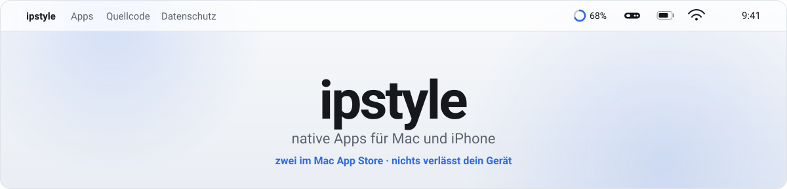

<picture>
  <source media="(prefers-color-scheme: dark)" srcset="img/banner-de-dark.svg">
  
</picture>

<a href="README.md">English →</a>

Native Apps für Mac und iPhone. Kein Electron, keine Tracker, keine Konten — was lokal laufen kann, läuft lokal.

<table>
<tr>
<td width="50%" valign="top">

<h3>AI-Cockpit</h3>

Alle KI-Budgets an einem Ort — Claude, ChatGPT/Codex, OpenAI- und Anthropic-API, Kimi — dazu die Claude-Code-Sessions, die gerade auf dem Mac laufen, mit Subagenten, Token-Anteilen und Kontextfenstern.

<a href="https://apps.apple.com/app/id6802014255"><picture>
<source media="(prefers-color-scheme: dark)" srcset="img/mas-badge-de-dark.svg">

</picture></a>

CHF 3.50, einmalig · macOS 14+ · <a href="https://aicockpit.info">aicockpit.info</a> · <a href="https://github.com/ipstyle/ai-cockpit-docs">Doku</a>
</td>
<td width="50%" valign="top">

<h3>BarBox</h3>

Die Menüleiste, aufgeräumt — CPU, Arbeitsspeicher und GPU live, Bilder verkleinern, Text aus Bild, PDFs zusammenfügen, Timer, Wetter und Kurse. Alles einen Klick entfernt.

<a href="https://apps.apple.com/app/id6802093315"><picture>
<source media="(prefers-color-scheme: dark)" srcset="img/mas-badge-de-dark.svg">

</picture></a>

Gratis · macOS 14+ · GPL-3.0 · <a href="https://github.com/ipstyle/barbox">Quellcode</a> · <a href="https://ipstyle.github.io/barbox/">Website</a>
</td>
</tr>
</table>

<b>Richtig anschauen</b> — die vollen Oberflächen

 

  

### In Arbeit

**[Baumängel Tracker](https://github.com/ipstyle/baumaengel-tracker)** — Mängelprotokoll mit Fotodokumentation fürs iPhone: Räume, Mängel, Fristen und am Schluss ein sauberes PDF. Im App-Review. MIT.

**Fristwart** — keine Kündigungsfrist mehr verpassen; rechnet zurück bis zum Tag, an dem abgeschickt sein muss. In Entwicklung.

### Wie ich baue

Beide Mac-Apps kommen über den Mac App Store, vollständig sandboxed. BarBox steht unter GPL-3.0 — wer lieber selbst baut, nimmt `swift build -c release`.

Nichts verlässt das Gerät. Zugangsdaten, wo überhaupt welche nötig sind, liegen im Schlüsselbund und nie in einer Einstellungsdatei. Keine Analyse, keine Konten, keine Werbung.

AI-Cockpit wurde gegen OWASP ASVS 4.0, OWASP MASVS, den Apple Secure Coding Guide, RFC 8252/7636 und die CWE Top 25 geprüft.

### Fehler gefunden?

Issue im betreffenden Repo aufmachen. Sicherheitsprobleme bitte über die private Meldefunktion des Repos statt als öffentliches Issue.
