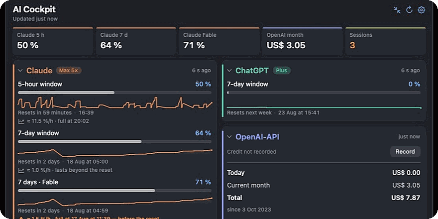
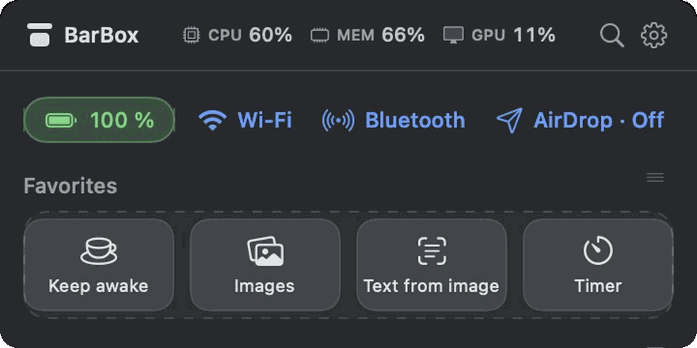
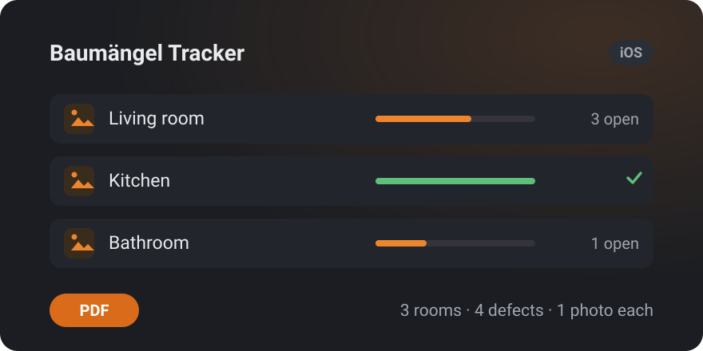
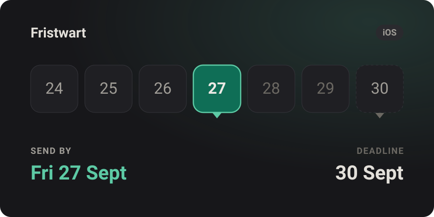

https://ipstyle.github.io/
<picture>
  <source media="(prefers-color-scheme: dark)" srcset="img/banner-dark.svg">
  
</picture>

<a href="README.de.md">Deutsch →</a>

Two apps on the Mac App Store, two more on the way. No Electron, no trackers, no accounts — what can run locally, runs locally.

<table>
<tr>
<td width="50%" valign="top">

 <b>AI-Cockpit</b> 
Every AI budget in one place.
  

  
<a href="https://apps.apple.com/app/id6802014255"><picture>
<source media="(prefers-color-scheme: dark)" srcset="img/mas-badge-dark.svg">

</picture></a>
 
CHF 3.50 once · macOS 14+ <a href="https://aicockpit.info">aicockpit.info</a> · <a href="https://github.com/ipstyle/ai-cockpit-docs">Docs</a>
</td>
<td width="50%" valign="top">

 <b>BarBox</b> 
The menu bar, tidied up.
  

  
<a href="https://apps.apple.com/app/id6802093315"><picture>
<source media="(prefers-color-scheme: dark)" srcset="img/mas-badge-dark.svg">

</picture></a>
 
Free · macOS 14+ · GPL-3.0 <a href="https://github.com/ipstyle/barbox">Source</a> · <a href="https://ipstyle.github.io/barbox/">Website</a>
</td>
</tr>
</table>

**AI-Cockpit** tracks Claude, ChatGPT/Codex, the OpenAI and Anthropic APIs and Kimi in one window — plus the Claude Code sessions running on your Mac, with subagents, token shares and context windows.
**BarBox** puts CPU, memory and GPU live in the menu bar, next to image compression, text from image, PDF merging, timers, weather and rates.

### Next up

<table>
<tr>
<td width="50%" valign="top">

 
<b>Baumängel Tracker</b> · <a href="https://github.com/ipstyle/baumaengel-tracker">source</a> 
Snag lists for iPhone — rooms, defects, photos, deadlines, and a clean PDF at handover. <b>In App Review.</b> MIT.
</td>
<td width="50%" valign="top">

 
<b>Fristwart</b> · <a href="https://ipstyle.github.io/fristwart-web/">about</a> 
Never miss a cancellation deadline — it counts back to the day you actually have to send. <b>In development.</b>
</td>
</tr>
</table>

### How I build

Both Mac apps ship through the Mac App Store, fully sandboxed. BarBox is GPL-3.0 — build it yourself with `swift build -c release` if you'd rather.

Nothing leaves your device. Credentials, where any are needed, live in the macOS Keychain and never in a settings file. No analytics, no accounts, no ads. Every app speaks English and German.

AI-Cockpit was reviewed against OWASP ASVS 4.0, OWASP MASVS, the Apple Secure Coding Guide, RFC 8252/7636 and the CWE Top 25.

### More

**[ipstyle.github.io](https://ipstyle.github.io)** — all four apps on one page, with full screenshots and the reasoning behind them.

### Found a bug?

Open an issue in the relevant repo. Please report security issues through the repo's private reporting feature rather than as a public issue.
