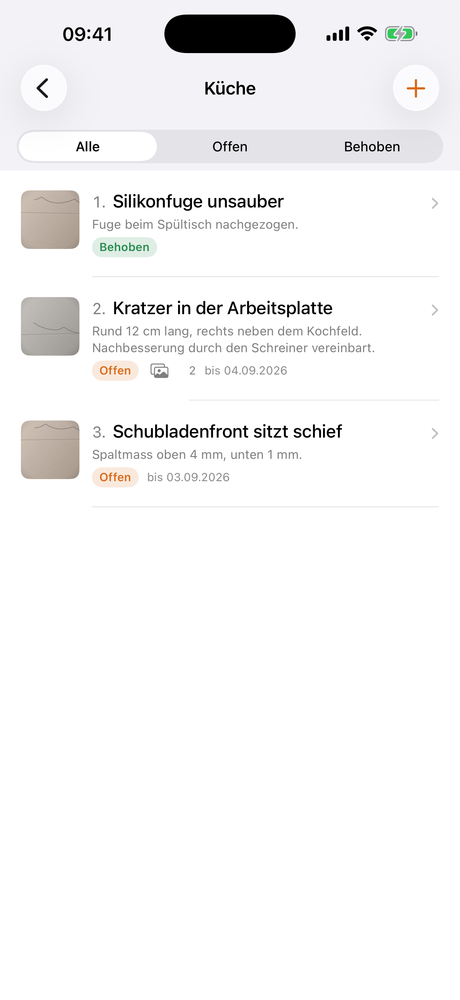

### Hi, I'm Albert 🇨🇭

Indie developer building small, native apps for Mac and iPhone — no Electron, no trackers, no accounts. What can run locally, runs locally.

---

### 🧠 AI-Cockpit — every AI budget, one glance

A macOS menu bar app that keeps every AI budget in one place: **Claude** subscription usage, **ChatGPT/Codex** quotas, **OpenAI** and **Anthropic** API costs, **Kimi** credit — plus the **Claude Code sessions** currently running on your Mac, with subagents, token shares and context windows.

**→ [aicockpit.info](https://aicockpit.info)** · Mac App Store: coming soon (CHF 3.50) · [Documentation](https://github.com/ipstyle/ai-cockpit-docs)

Security-reviewed against OWASP ASVS 4.0, OWASP MASVS, the Apple Secure Coding Guide, RFC 8252/7636 and the CWE Top 25. Developer-ID signed and notarized. English and German UI.

---

### 🧰 BarBox — the macOS menu bar, tidied up

Free, open-source menu bar toolbox: live CPU/MEM/GPU stats, image compression, text from image (OCR), PDF merging, timers, weather and finance — everything one click away.

**→ [github.com/ipstyle/barbox](https://github.com/ipstyle/barbox)** — free, source available, no account, no tracking.

---

### 🛠️ Baumängel Tracker — snag lists for iPhone

Photo-documented defect tracking for construction handovers: add rooms, log defects with photo and deadline, tick them off — and export a clean PDF report at the end.

**→ [github.com/ipstyle/baumaengel-tracker](https://github.com/ipstyle/baumaengel-tracker)** — free, source available, no account, no ads, no analytics.

---

### How I build

Everything runs locally — no data ever leaves the device unless you explicitly share it. Credentials, where needed, live in the macOS Keychain, never in a settings file.

The open-source apps are unsigned unless noted otherwise — the first launch needs the usual detour through System Settings → Privacy & Security. Prefer to build it yourself? `swift build -c release`, instructions in each repo's README.

### Found a bug?

Open an issue in the relevant repo. Please report security issues through the repo's private reporting feature, not as a public issue.
