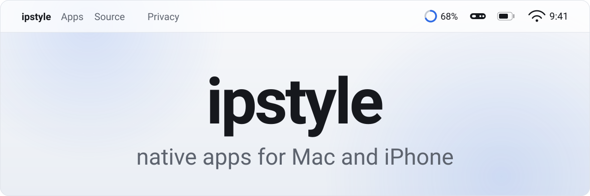
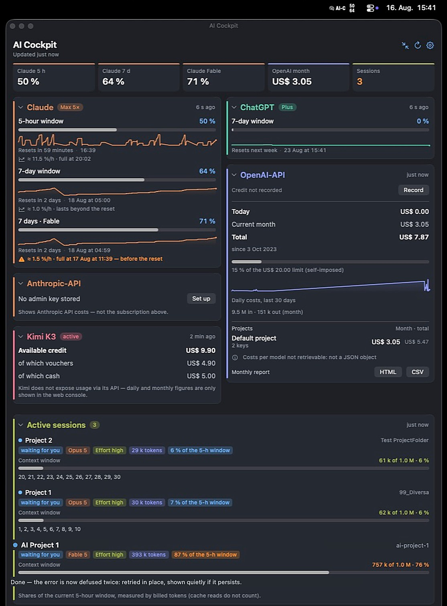
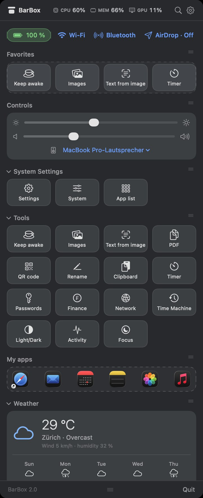

<picture>
  <source media="(prefers-color-scheme: dark)" srcset="img/banner-dark.svg">
  
</picture>

<a href="README.de.md">Deutsch →</a>

Native apps for Mac and iPhone. No Electron, no trackers, no accounts — what can run locally, runs locally.

<table>
<tr>
<td width="50%" valign="top">

<h3>AI-Cockpit</h3>

Every AI budget in one place — Claude, ChatGPT/Codex, OpenAI and Anthropic API, Kimi — plus the Claude Code sessions running on your Mac, with subagents, token shares and context windows.

<a href="https://apps.apple.com/app/id6802014255"><picture>
<source media="(prefers-color-scheme: dark)" srcset="img/mas-badge-dark.svg">

</picture></a>

CHF 3.50, one-time · macOS 14+ · <a href="https://aicockpit.info">aicockpit.info</a> · <a href="https://github.com/ipstyle/ai-cockpit-docs">Docs</a>
</td>
<td width="50%" valign="top">

<h3>BarBox</h3>

The menu bar, tidied up — live CPU, memory and GPU stats, image compression, text from image, PDF merging, timers, weather and finance. Everything one click away.

<a href="https://apps.apple.com/app/id6802093315"><picture>
<source media="(prefers-color-scheme: dark)" srcset="img/mas-badge-dark.svg">

</picture></a>

Free · macOS 14+ · GPL-3.0 · <a href="https://github.com/ipstyle/barbox">Source</a> · <a href="https://ipstyle.github.io/barbox/">Website</a>
</td>
</tr>
</table>

<b>See them properly</b> — full dashboards

 

  

### In the works

**[Baumängel Tracker](https://github.com/ipstyle/baumaengel-tracker)** — snag lists with photo documentation for iPhone: rooms, defects, deadlines, and a clean PDF report at the end. In App Review. MIT.

**Fristwart** — never miss a cancellation deadline; it counts back to the day you have to send. In development.

### How I build

Both Mac apps ship through the Mac App Store, fully sandboxed. BarBox is GPL-3.0 — build it yourself with `swift build -c release` if you'd rather.

Nothing leaves your device. Credentials, where any are needed, live in the macOS Keychain and never in a settings file. No analytics, no accounts, no ads.

AI-Cockpit was reviewed against OWASP ASVS 4.0, OWASP MASVS, the Apple Secure Coding Guide, RFC 8252/7636 and the CWE Top 25.

### Found a bug?

Open an issue in the relevant repo. Please report security issues through the repo's private reporting feature rather than as a public issue.
